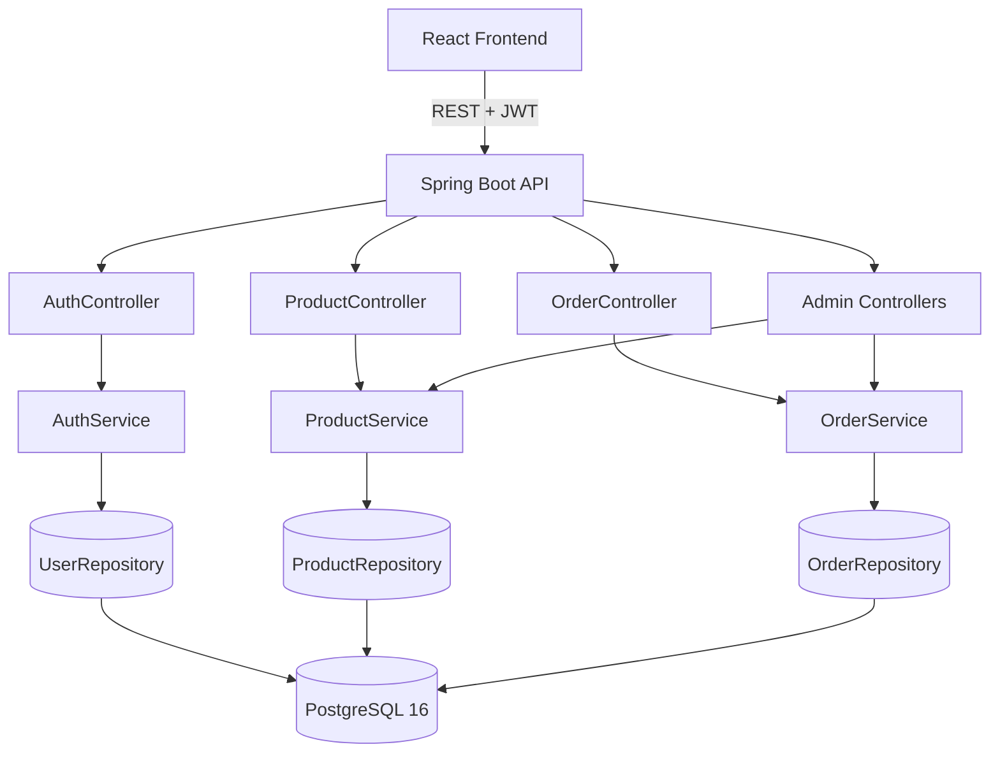
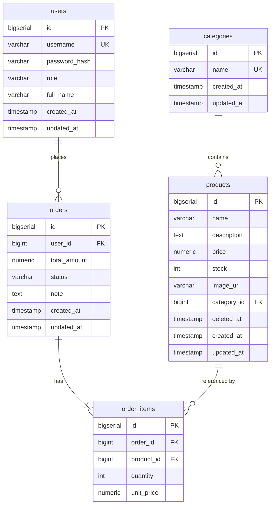

# 7-Eleven Shop Backend API

REST API backend for 7-Eleven Vietnam shop management — handles product catalog, order placement and admin operations.
Built as a technical test for the Fresher Java Engineer position at 7-Eleven Vietnam.

**Frontend repo:** _[link will be added after frontend is complete]_

---

## Tech Stack


| Layer | Technology |
|---|---|
| Language | Java 17 |
| Framework | Spring Boot 3.2.5 |
| Security | Spring Security 6 + JWT (jjwt 0.12.5) |
| Persistence | Spring Data JPA + Hibernate + Flyway |
| Database | PostgreSQL 16 |
| Mapping | MapStruct 1.5.5 |
| Documentation | springdoc-openapi (Swagger UI) |
| Testing | JUnit 5 + Mockito + Testcontainers |
| Build | Maven 3.9 |
| Container | Docker + Docker Compose |
| CI | GitHub Actions |

---

## Architecture

```
┌─────────────────────────────────────────────────────────┐
│  React Frontend (port 5173)                             │
└─────────────────────┬───────────────────────────────────┘
                      │ HTTP / REST + JWT
┌─────────────────────▼───────────────────────────────────┐
│  Spring Boot Application (port 8080)                    │
│                                                         │
│  ┌────────────┐   ┌────────────┐   ┌────────────────┐  │
│  │ Controller │──▶│  Service   │──▶│  Repository    │  │
│  │ (REST API) │   │ (Business) │   │ (Spring Data)  │  │
│  └────────────┘   └────────────┘   └───────┬────────┘  │
│                                            │            │
│  ┌─────────────────────────────────────────▼──────────┐ │
│  │  Spring Security (JWT filter + Role-based access)  │ │
│  └────────────────────────────────────────────────────┘ │
└─────────────────────────────────────────────────────────┘
                      │ JDBC
┌─────────────────────▼───────────────────────────────────┐
│  PostgreSQL 16 (Flyway-managed schema)                  │
└─────────────────────────────────────────────────────────┘
```



---

## ERD



---

## Getting Started

### Prerequisites
- Docker Desktop (for Option 1)
- Java 17 + Maven 3.9 + PostgreSQL 16 (for Option 2)

### Option 1 — Docker Compose (recommended)

```bash
# 1. Clone the repo
git clone <repo-url>
cd seven-eleven-shop-backend

# 2. Copy and configure environment
cp .env.example .env
# Edit .env if needed (defaults work for local dev)

# 3. Start everything in one command
docker compose up --build

# API is ready at http://localhost:8080
# Swagger UI at http://localhost:8080/swagger-ui.html
```

### Option 2 — Local Development

```bash
# 1. Start PostgreSQL 16 (ensure it's running on port 5432)
# Create a database named 'shop'

# 2. Clone and run
git clone <repo-url>
cd seven-eleven-shop-backend

# 3. Run with dev profile
mvn spring-boot:run -Dspring-boot.run.profiles=dev

# Or set env vars explicitly:
DB_URL=jdbc:postgresql://localhost:5432/shop \
DB_USERNAME=postgres \
DB_PASSWORD=postgres \
mvn spring-boot:run
```

---

## Default Credentials

| Role | Username | Password |
|------|----------|----------|
| Admin | `admin` | `admin123` |
| Customer | `customer1` | `customer123` |
| Customer | `customer2` | `user123` |

> Users are seeded automatically on first startup via `DataInitializerConfig`.

---

## API Documentation

Swagger UI: **http://localhost:8080/swagger-ui.html**

### Endpoint Summary

| Method | Endpoint | Auth | Description |
|--------|----------|------|-------------|
| `POST` | `/api/auth/login` | Public | Login, returns JWT |
| `POST` | `/api/auth/register` | Public | Register customer |
| `GET` | `/api/categories` | Public | List all categories |
| `GET` | `/api/products` | Public | List products (search, filter, page) |
| `GET` | `/api/products/{id}` | Public | Product detail |
| `POST` | `/api/admin/products` | ADMIN | Create product |
| `PUT` | `/api/admin/products/{id}` | ADMIN | Update product |
| `DELETE` | `/api/admin/products/{id}` | ADMIN | Soft-delete product |
| `POST` | `/api/orders` | CUSTOMER | Place an order |
| `GET` | `/api/orders/my` | CUSTOMER | My order history |
| `GET` | `/api/admin/orders` | ADMIN | All orders (filter by status/date) |
| `GET` | `/api/admin/orders/{id}` | ADMIN | Order detail |
| `PUT` | `/api/admin/orders/{id}/status` | ADMIN | Update order status |

**Auth header:** `Authorization: Bearer <token>`

**Product search params:** `?page=0&size=10&search=trà&categoryId=1&sortBy=price&direction=asc`

**Admin order filter params:** `?status=PENDING&from=2025-01-01T00:00:00&to=2025-12-31T23:59:59`

---

## Running Tests

```bash
# Run all unit tests
mvn test

# Run with verbose output
mvn test -Dsurefire.useFile=false

# Run a specific test class
mvn test -Dtest=OrderServiceTest
```

Unit tests use Mockito and do not require a running database.

---

## Project Structure

```
seven-eleven-shop-backend/
├── src/main/java/vn/sevenleven/shop/
│   ├── ShopApplication.java
│   ├── config/
│   │   ├── DataInitializerConfig.java   # seeds admin + customers on startup
│   │   ├── JpaAuditingConfig.java
│   │   ├── OpenApiConfig.java
│   │   └── SecurityConfig.java
│   ├── controller/
│   │   ├── AuthController.java
│   │   ├── ProductController.java       # public: GET /api/products
│   │   ├── AdminProductController.java  # ADMIN: /api/admin/products
│   │   ├── OrderController.java         # CUSTOMER: /api/orders
│   │   ├── AdminOrderController.java    # ADMIN: /api/admin/orders
│   │   └── CategoryController.java
│   ├── service/
│   │   ├── AuthService.java + impl/
│   │   ├── ProductService.java + impl/
│   │   ├── OrderService.java + impl/    # PESSIMISTIC_WRITE lock for stock
│   │   └── CategoryService.java + impl/
│   ├── repository/                      # Spring Data JPA
│   ├── entity/                          # JPA entities (extend BaseEntity)
│   ├── dto/request/                     # Java records with @Valid
│   ├── dto/response/                    # Java records
│   ├── mapper/                          # MapStruct
│   ├── security/                        # JWT filter + UserDetailsService
│   ├── exception/                       # GlobalExceptionHandler + custom exceptions
│   └── enums/                           # Role, OrderStatus
├── src/main/resources/
│   ├── application.yml
│   ├── application-dev.yml
│   ├── application-docker.yml
│   └── db/migration/
│       ├── V1__init.sql                 # Schema DDL
│       └── V2__seed_data.sql            # Categories + products
├── src/test/java/vn/sevenleven/shop/
│   └── service/
│       ├── OrderServiceTest.java        # 5 test cases with Mockito
│       └── ProductServiceTest.java      # 4 test cases with Mockito
├── Dockerfile                           # Multi-stage build
├── docker-compose.yml
├── pom.xml
├── .env.example
├── .gitignore
└── .github/workflows/ci.yml
```

---

## Contact

**Huỳnh Việt Đan** — vdan2242004@gmail.com
